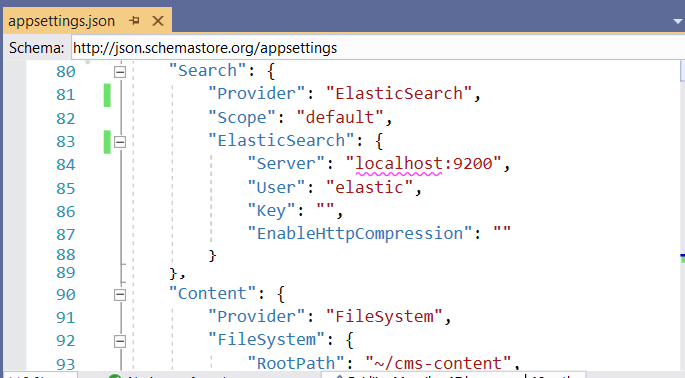
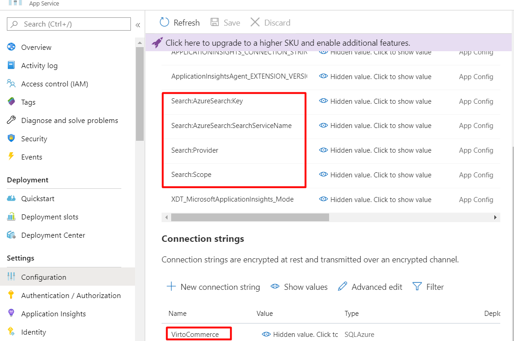

# Appsettings.json
As Virto Commerce Platform (VC Platform) is an ASP.NET Core based application, it can be configured as described in [this Microsoft article](https://docs.microsoft.com/en-us/aspnet/core/fundamentals/configuration/?view=aspnetcore-3.1).

## Configuration Settings
The configuration keys are hierarchic, and the most convenient way to manage them is working with the _appsettings.json_ file. The table below shows the overall file structure, provides default values, and explains what each key is about.

!!! note
    * All settings listed below are optional unless marked **Required**.

| Top Configuration Node | Child Node(s) | Default or Sample Value  | Description  |
| ---------------------- | ------------- | ------------------------ | ------------ |
| ConnectionStrings    |  |  | These **required** settings represent connection strings for VC Platform and modules.
|  | VirtoCommerce | E.g., `Data Source=(local);Initial Catalog=VirtoCommerce3;Persist Security Info=True;User ID=virto;Password=virto; MultipleActiveResultSets=True;Connect Timeout=30` | This **required** setting is for providing VC Platform system connection string to the SQL Server database. VC modules would revert to this connection string in case no specific connection string was defined.                          |
|  | E.g., VirtoCommerce.Catalog        | E.g., `Data Source=(local);Initial Catalog=VirtoCommerceCatalog;Persist Security Info=True;User ID=virto;Password=virto; MultipleActiveResultSets=True;Connect Timeout=30` | Other module-specific connection string(s). E.g., Virto Commerce Catalog module would use `VirtoCommerce.Catalog` connection string in case it is defined. |
| | RedisConnectionString | E.g., `"localhost"` | StackExchange.Redis Configuration string. Check [Redis Configuration](https://stackexchange.github.io/StackExchange.Redis/Configuration) for details.
| VirtoCommerce |  |  | VC Platform system settings
|  | CountriesFilePath |`"localization/common/countries.json"` | Local path for the country list, which, by default, includes all countries of the world.
|  | CountryRegionsFilePath |`"localization/common/countriesRegions.json"` | Local path for state/province list. By default, includes the US states and Canada's provinces.
|  | LicenseActivationUrl |`"https://virtocommerce.com/admin/api/licenses/activate/"` | VC Platform license activation service URL
|  | LicenseFilePath |      `"App_Data/VirtoCommerce.lic"`                            | VC Platform license file location
|  | LocalUploadFolderPath | `"App_Data/Uploads"`                                     | The *Uploads* folder location
|  | SampleDataUrl | E.g., `"http://virtocommerce.azureedge.net/sample-data"` | URL to download sample data upon the initial Platform setup
|  | DiscoveryPath | `"./Modules"` | Relative or absolute folder location where the platform will discover the installed modules from
|  | AllowInsecureHttp | `false` | Manages how the OpenID Connect server (ASOS) handles the incoming requests: whether those arriving to non-HTTPS endpoints should be rejected or not. By default, this property is set to false to help mitigate the man-in-the-middle attacks.
|  | Hangfire          | E.g.  "Hangfire": {             "JobStorageType": "Memory",             "UseHangfireServer": true,             "AutomaticRetryCount": 1,             "SqlServerStorageOptions": {                 "CommandBatchMaxTimeout": "00:05:00",                 "SlidingInvisibilityTimeout": "00:05:00",                 "QueuePollInterval": "00:00:00",                 "UseRecommendedIsolationLevel": true,                 "UsePageLocksOnDequeue": true,                 "DisableGlobalLocks": true,                 "EnableHeavyMigrations": true             }         }   | Background processing library (Hangfire) configuration.   `JobStorageType`: Current job storage. Supported values: _Memory_, _SqlServer_.  `UseHangfireServer`: Enables or disables Hangfire for this app instance.  `AutomaticRetryCount`: Maximum number of automatic retry attempts.  `SqlServerStorageOptions`: Hangfire.SqlServer.SqlServerStorageOptions. Check [Hangfire's SQL Server Configuration](https://docs.hangfire.io/en/latest/configuration/using-sql-server.html#configuration) documentation for details.
|  | Swagger | E.g.  "Swagger": { "Disable": true }| Allows to disable Swagger initialization upon platform startup to prevent access to Swagger UI and documents.
|  | FileExtensionsBlackList | E.g.  "FileExtensionsBlackList": [".pdf", ".json"]| This setting is used together with the `VirtoCommerce.Platform.Security.FileExtensionsBlackList` setting (admin UI) to set the extensions of the files the platform does not permit to upload to the server. The `FileExtensionsBlackList` is not accessible from the admin UI. An administrator may provide an additional list of extensions through the UI that may be used with `FileExtensionsBlackList`.
|Assets |  |  | This **required** setting determines how VC Platform will be working with assets, i.e. files.
|  | Provider | `"FileSystem"` | Current asset provider. Supported values: FileSystem, AzureBlobStorage.
|  | FileSystem | E.g.,   "FileSystem": {  "RootPath": "~/assets", "PublicUrl": "http://localhost:10645/assets/" } | File system based asset provider configuration. Used when the `Provider` setting has the `FileSystem` value.
|  | AzureBlobStorage | E.g.,   "AzureBlobStorage": {  "ConnectionString": "", "CdnUrl": "" }  | Azure Blob Storage based asset provider configuration. Used when the `Provider` setting has the `AzureBlobStorage` value.
| IdentityOptions | | | Options to configure the ASP.NET Core Identity system. Refer to [this guide](https://github.com/dotnet/AspNetCore.Docs/blob/master/aspnetcore/security/authentication/identity-configuration.md#configure-aspnet-core-identity) for details.
|  | Password.PasswordHistory | E.g.,  "PasswordHistory": 4 | The number of recent user passwords to check during password validation. An old password cannot be reused for this number of cycles. If the value is set to `0` or not defined, the password history will be disabled.
|  | Password.RepeatedResetPasswordTimeLimit | "RepeatedResetPasswordTimeLimit": "0:01:0" | The time limit after which a user can request password reset.
|  | User.MaxPasswordAge | "MaxPasswordAge": "0" | The time span defining the maximum user password age until it expires. The user is forced to change the expired password upon login to the Platform Manager UI. If the value is set to `0` or not defined, password expiration will be disabled.
|  | User.RemindPasswordExpiryInDays | "RemindPasswordExpiryInDays": 7  | Number of days to start showing password expiry warning in the Platform Manager UI. Used only when password expiration is enabled. 
| ExternalModules | | | Configures external sources to install the modules from.
|  | IncludePrerelease | `false` | Shows module versions marked as *Prerelease* if value is `true`.
|  | ModulesManifestUrl | E.g., `"https://raw.githubusercontent.com/VirtoCommerce/vc-modules/master/modules_v3.json"` | URL to the *.json* file that contains module manifests.
|  | AuthorizationToken | | The authorization token to access `ModulesManifestUrl`, added to the `Authorization` header, if specified.
|  | AutoInstallModuleBundles | `["commerce"]` | Group(s) of modules to install automatically during the initial Platform setup. If you do not need to install anything here, provide an empty array.
| Caching |  |  | Caching configuration
|  | Redis | E.g.,  "Redis": { "ChannelName": "VirtoCommerceChannel", "BusRetryCount": 3 } | Redis configuration, which includes the message channel to use and number of times to retry.
|  | CacheEnabled | `true` | If set to `true`, cache entries are retained based on the _expiration settings_. Otherwise, cache entries will expire immediately. Used if _ConnectionStrings\:RedisConnectionString_ is not specified.
|  | CacheSlidingExpiration | E.g., `"0:15:00"` | Cache entry will expire if it has not been accessed in a set amount of time. Used in case `CacheAbsoluteExpiration` was not defined.
|  | CacheAbsoluteExpiration | E.g., `"0:5:00"` | Cache entry will expire after a set amount of time. Used in case `RedisConnectionString` was not specified.
| Notifications | | | Notification configuration for the `VirtoCommerce.Notifications` module
|  | Gateway | E.g., `"SendGrid"` | The current notification sending gateway. The out of the box implemented and supported values are `Smtp`, `SendGrid`.
|  | DefaultSender | E.g., `"noreply@gmail.com"` | This **required** setting provides sender identification used by the current notification sending gateway.
|  | Smtp | E.g., "Smtp": { "SmtpServer": "http://smtp.gmail.com", "Port": 587, "Login": "my-login", "Password": "my-password" } | Smtp gateway configuration. Used if the `Gateway` setting has the `Smtp` value.
|  | SendGrid | E.g., "SendGrid": { "ApiKey": "my-SendGrid-Api-Key" } | SendGrid gateway configuration. Used when the `Gateway` setting has the `SendGrid` value.
| Search | | | Full text search configuration for the `VirtoCommerce.Search` module
|  | Provider | E.g., `"Lucene"` | This **required** setting specifies the current search provider. The supported values are  `Lucene`, `AzureSearch`, and `ElasticSearch`.
|  | Scope | E.g., `"default"`   | This setting determines the scope to use and is **required**.
|  | Lucene | E.g., "Lucene": { "Path": "App_Data/Lucene" } | Lucene provider configuration for the _VirtoCommerce.LuceneSearch_ module. Used when the `Provider` setting has the `Lucene` vaue.
|  | AzureSearch | E.g., "AzureSearch": { "SearchServiceName": "my-ServiceName", "Key": "my-AccessKey" } | AzureSearch provider configuration for the _VirtoCommerce.AzureSearch_ module. Used when the `Provider` setting has the `AzureSearch` value.
|  | ElasticSearch | E.g., "ElasticSearch": { "Server": "localhost:9200", "User": "elastic", "Key": "", "EnableHttpCompression": "" } | Elasticsearch  provider configuration for the _VirtoCommerce.ElasticSearch_ module. Used when the `Provider` setting has the `ElasticSearch` value.
| Content | | | This **required** setting is used for static content configuration (including themes) for the `VirtoCommerce.Content` module.
|  | Provider | `"FileSystem"` | Current content (file) provider. The supported values are `FileSystem` and 			`AzureBlobStorage`.
|  | FileSystem | E.g.,   "FileSystem": {  "RootPath": "~/cms-content", "PublicUrl": "http://localhost:10645/cms-content/" }  | File system based content provider configuration. This is the default provider used unless `AzureBlobStorage` is set as the current provider.
|  | AzureBlobStorage | E.g.,   "AzureBlobStorage": {  "ConnectionString": "", "CdnUrl": "" }  | Azure Blob Storage based content provider configuration. Used when the `Provider` setting has `AzureBlobStorage` as value.
| AzureAd | | | Used for authentication with Azure Active Directory. Check [how to enable authentication with Azure Active Directory](https://github.com/VirtoCommerce/vc-platform/blob/master/docs/techniques/authentication-with-azure-ad.md) for details. 
|  | Enabled | `false` | Enables authentication with Azure Active Directory. By default, this value is `false`, i.e. the authentication is deisabled.
|  | UsePreferredUsername | `false` | If set to `true`, the system will check the `preffered_username` in case the `upn` claim returns empty.
|  | Priority | 0 | Configures the priority of the Azure Active Directory login popup on the _Login_ page. The lowest value means the highest priority.
| PasswordLogin | | | Enables authentication with username and password. 
|  | Enabled | `true` | Always enabled by default. Setting to `false` will disable logging in with username and password.
|  | Priority | 0 | Configures the priority of the password login popup on the _Login_ page. The lowest value means the highest priority.
| LoginPageUI | | | Used for configuration of the background screen and background pattern of the _Login_ page.
|  | BackgroundUrl | | Login page background URI. If set, takes priority over the preset.
|  | PatternUrl | | Login page background pattern URI. If set, takes priority over the preset.
|  | Preset | `demo` | Login page background preset name. If set, searches the preset from the preset list and applies `BackgroundUrl` and `PatternUrl` from it.
|  | Presets | E.g., [{ "Name": "demo", "BackgroundUrl": "images/login_background.png", "PatternUrl": "/images/pattern-demo.svg" }, { "Name": "prod", "BackgroundUrl": "", "PatternUrl": "/images/pattern-live.svg" }] | A list of background presets.

## Hierarchic Keys and Separators
When working with keys, one should follow these rules:

* Within the Configuration API, a colon separator (`:`) works on all platforms.
* In environment variables, a colon separator may not work on all platforms. A double underscore, `__`, is supported by all platforms and is automatically converted into a colon `:`.
* In Azure Key Vault, hierarchic keys use double hyphen `--` as a separator. The Azure Key Vault configuration provider automatically replaces `--` with a `:` when the secrets are loaded into the app configuration.

The images below show some examples of using the above rules:

*Configuring ElasticSearch on localhost in the `appsettings.json` file*

_Configuring `VirtoCommerce ConnectionString` and other settings through **environment variables** in the **docker-compose.yml** file_

_Configuring `AzureSearch` and other settings trough the **Application settings** in **Azure**_

You can find more details in [this ASP.NET configuration guide](https://docs.microsoft.com/en-us/aspnet/core/fundamentals/configuration/?view=aspnetcore-3.1#configuration-keys-and-values).

