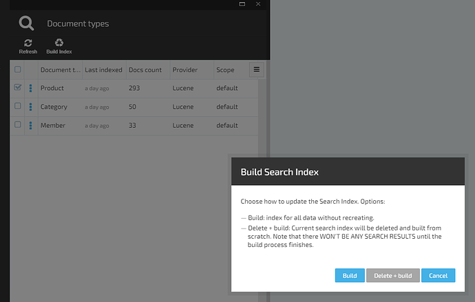
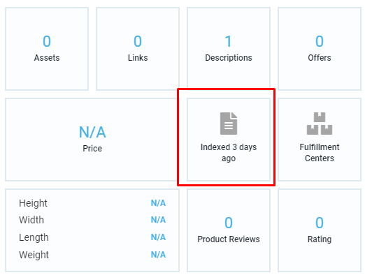
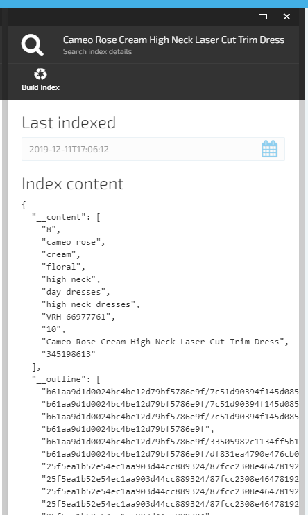
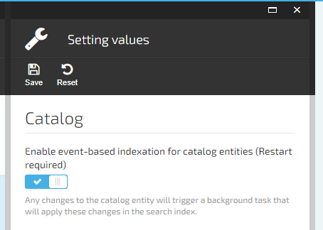


# Indexing in Platform Manager
You can work with various indexing features through Platform Manager.

## Manual Indexing

You can initiate the indexing process manually by following these steps:

1. Go to **Search Index** → Select the required document type -> Then click the **Build** button to start indexing → Select one of the two options:

* Build: Index all data without recreating

* Delete and Build: The current search index will be deleted and built from scratch

2. Wait for the indexing process to complete. The time it may take depends on the number of entities.

### Viewing Index Document

Platform Manager allows you to preview the index document data without having to write any code. You can use a special widget that will take you to previewing raw JSON data being used for the document that is stored in the index storage. To do so, open the **Product** blade and click the **Search Index** widget:

### Incremental Index Updates

Virto commerce can update search indexes incrementally in the background by tracking entity changes and injecting changed entities into the index.

Various modules have their own jobs and settings.

For example, the Catalog module has two types for incremental indexing:

+ **Event-based**: Indexing is triggered when a product gets changed.
    
+ **Time-based**: A background job checks and re-indexes modified objects every X minutes (5 by default). This type is disabled by default.
    
You can change behavior by going to **Settings** > **Catalog** >**Search**:

