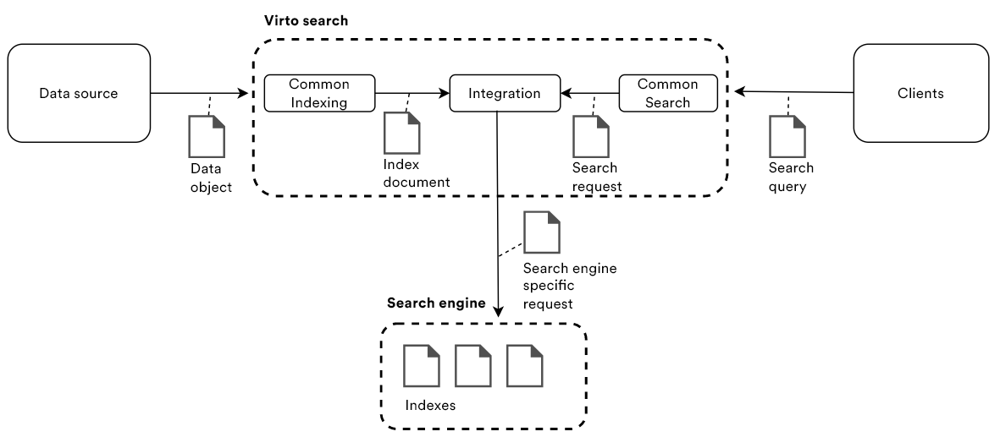
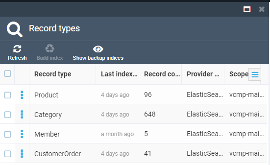
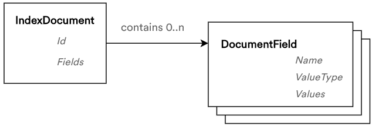
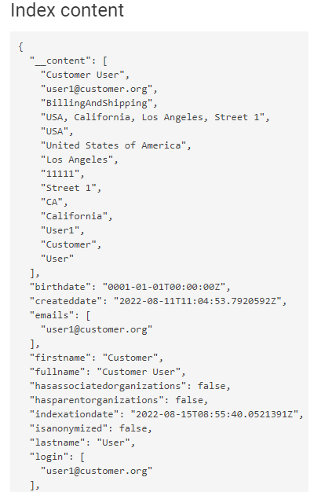

# Indexed Search Overview

This article provides an overview of indexed search that is  one of key feature of  any  commerce solution.

Virto Search is a search component that gives developers infrastructure, APIs, and tools for building a rich search experience over  heterogeneous platform entities.

Search is foundational to any eCommerce app that surfaces text content to users, with common scenarios including catalog or various entities search, or data exploration.

Architecturally, a search service sits between the  data stores that contain your un-indexed data, and client app that sends query requests to a search index and handles the response and external search engines that handles as all index and search requests. 

Below, we list the main Virto Commerce Indexed Search concepts: 

Search indexes: A logical group (container) that contains all documents (rows) of single document Type and each document has Fields (columns). Usually it maps to the concrete index in the Index provider e.g elastic search index. In the Virto we have the following indexes by default:

+ Product: For catalog item search

+ Category: For catalog category search

+ Member: For customer data  search

+ CustomerOrder: For order search

Index document: Conceptually, a document is a single unit of searchable data in your index.  For example, a  document for each product in catalog, mapping these concepts to more familiar database equivalents: a search index equates to a table, and documents are roughly equivalent to rows in a table.

The structure of a document is determined by the index schema, as illustrated below. The "Fields" collection is typically the largest part of an index, where each field is named, assigned a value type, and attributed with allowable behaviors that determine how it is used.

Here is how an index may look like:

Indexing: A process for data indexing that extracts searchable content from various Data sources and populates a Search index in the concrete search provider  with instances of  Index documents that is created from  source data by Index document builders. <!---The  indexing process architecture reference  ([Backend development] Fundamentals / Indexed Search / Indexing)-->

Search query: A  string consisting of keyword and terms that is processed by custom query syntax parser and transforms to common Search request that is a complete specification of what should be returned in a result set. Here is an example:

`Asus color:Black,Blue price.usd:[100 TO 200)`

<!---(TODO: Link to search syntax reference)-->

Search: Enables performing search tasks with indexed data, receives the Search phrase in special query language and interprets a string into Virto common Search request object that can be supplied to a specific Search engine through Integration  connector. The key search features include:

+ Full text search with extensions for fuzzy search, proximity search, term boosting, and regular expressions

+ Faceted navigation and filters that allows users to navigate through a web site by applying filters for categories, attributes, price ranges and so on. Can be used to incorporate faceted navigation into your application's UI, enhance query formulation, and filter based on user- or developer-specified criteria. 

Integration: Integration middleware providing integration to a specific Search Engine that enables mapping for objects of internal intermediated types, Index Documents and Search Request, into the respective document and query objects that a particular search engine expects to receive.     

Search Engine: A specific index search engine that handles all indexing and search requests. Virto has ready made integrations with the following services:

+ Lucene (only for the dev mode)

+ Elasticsearch <!---(TODO: link to configure Elasticsearch provider)-->

Azure Cognitive Search <!---(TODO: link to configure Azure Cognitive Search provider)-->