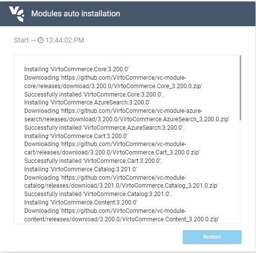

# Manual Installation with Precompiled Binaries
This section explains how to install Virto Commerce on a Windows based PC.

## Downloading Precompiled Platform Version
To download the precompiled files, navigate to the [Releases](https://github.com/VirtoCommerce/vc-platform/releases "https://github.com/VirtoCommerce/vc-platform/releases") section of our public GitHub repository.

Locate the *VirtoCommerce.Platform.3.x.x.zip* archive, which already has the website built and can be run without any additional compilation. The source code, however, is not included.

Unpack the zipped archive to a local directory, e.g., `C:\vc-platform-3`. That's it, you've got a directory with the precompiled platform files.

## Updating Settings File
Once you have downloaded and unpacked the files, you will need to adjust the settings. Open the *appsettings.json* file in your text editor and change the `VirtoCommerce` string in the `ConnectionStrings` section.

> ***Important:*** *The provided user must have enough permissions to create a new database.*

<details><summary>ConnectionStrings Section Example</summary>
```json
1 "ConnectionStrings": { 
2 "VirtoCommerce" : "Data Source={SQL Server URL};Initial Catalog={Database name};Persist Security Info=True;User ID={User name};Password={User password};MultipleActiveResultSets=True;Connect Timeout=30" 
3 },
```
</details>

This is how the string in question may look like after you change it:

`appsettings.json`

`"VirtoCommerce": "Data Source=(local);Initial Catalog=VirtoCommerce3;Persist Security Info=True;User ID=virto;Password=virto;Connect Timeout=30",`

## Installing Self Signed SSL Certificate
Another step before launching the platform is installing and trusting the HTTPS certificate.

In order to trust the certificate, run this command:

`dotnet dev-certs https --trust`

For more information, please refer to [this Microsoft article](https://docs.microsoft.com/en-us/aspnet/core/security/enforcing-ssl?view=aspnetcore-3.0&tabs=visual-studio#trust). 

## Launching Platform
In order to launch the platform, run this command:
```
dotnet VirtoCommerce.Platform.Web.dll
```
*Note: The command above will run the Platform enforcing the HTTPS schema. You can also add HTTP URLs in the `--urls` argument of the `dotnet` command for development or demo purposes (see below). For security reasons, however, you should never use it in the production mode.*
```
dotnet VirtoCommerce.Platform.Web.dll --urls=http://localhost:5000
```

## First Time Launch
To launch the platform for the first time, open your browser and type http://localhost:5000 or https://localhost:5001. You may get the *Your connection is not private* error; in this case, click *Advanced* and then *Proceed to...*:


You can also remove this error using a [self signed certificate](https://www.hanselman.com/blog/DevelopingLocallyWithASPNETCoreUnderHTTPSSSLAndSelfSignedCerts.aspx).

The application will then create and initialize the database. After that, you should see the sign in page. Supply *admin* for login and *store* for password.

After you log into the platform for the first time, the installation wizard will show up and download default modules and sample data:



Once the wizard is done installing, you will be prompted to reset the default credentials:


This is it! Your platform is good to go.
