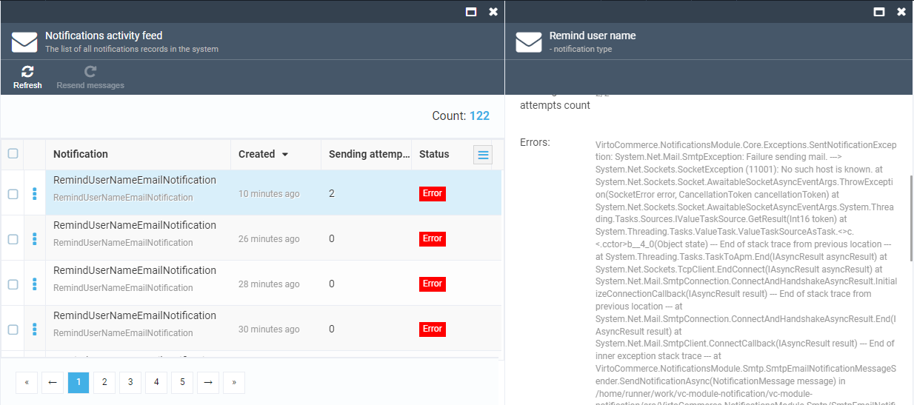

# Configuring Email Notifications
Virto Commerce Platform enables sending email notifications for various system events, such as restoring passwords, customer order processing, etc. In order to send such notifications, you will need to use a third-party email service provider that will handle email delivery. All you have to do is set up an mail gateway so that the platform may start sending emails. Currently, the only two options for gateways available are SMTP and SendGrid (see below for details).

## Prerequisites
In order to enable sending and receiving notifications, you must have the [Notification module](https://github.com/VirtoCommerce/vc-module-notification ) installed.

## Configuring SMTP Email Settings
This is how you can work with the SMTP settings with *Gmail.com* provider as an example.

To enable sending notifications through Gmail, turn on the  `Allow less secure apps` option in [Google Security Settings](https://www.google.com/settings/security/lesssecureapps "https://www.google.com/settings/security/lesssecureapps"). Then, edit the `Notifications`  section in the *appsettings.json* file:

`appsettings.json`

```json
1 ...
2 "Notifications": {
3        "Gateway": "Smtp", 
4        "DefaultSender": "noreply@gmail.com", //the default sender address
5        "Smtp": {
6            "SmtpServer": "http://smtp.gmail.com",
7            "Port": 587, //TLS port
8            "Login": "", //Your full Gmail address (e.g. you@gmail.com)
9            "Password": "" //The password that you use to log in to Gmail
10        },
11    },
12 ....
```

> ***Important***: *After making any changes to the appsettings.json file, be sure to restart the application for those changes to apply.*

## Configuring SendGrid Email Settings
In order to work with the SendGrid settings, you must have a SendGrid account. To learn how to set up one, as well as other relevant details, refer to [this SendGrid article](https://docs.sendgrid.com/for-developers/partners/microsoft-azure-2021).

Once your account is up and running, edit the `Notifications`  section in the *appsettings.json* file:

`appsettings.json`

```json
1 ...
2 "Notifications": {
3         "Gateway": "SendGrid", 
4        "DefaultSender": "noreply@gmail.com", //the default sender address
5        "SendGrid": {
6            "ApiKey": "your API key", //SendGrid API key
7        },
8    },
9....
```

## Testing Notification Sending Process 

To test your notifications, you will need to use REST Admin API queries that require a valid Shopify access token.

To test whether an email has been sent successfully, run this query:

```
curl -X POST "https://localhost:5001/api/notifications/send" -H  "accept: text/plain" -H  "Authorization: Bearer {access_token}" -H  "Content-Type: application/json-patch+json" -d '{"type":"RemindUserNameEmailNotification","from":"no-reply@mail.com","to":"{your email}"}''
```

In case of success, you will receive an test email on your email account. Otherwise, go to *Notifications → Notification activity feed* to see which error(s) led to a failure:


